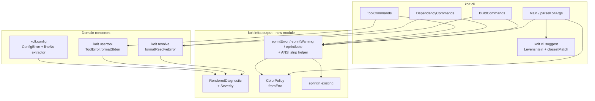
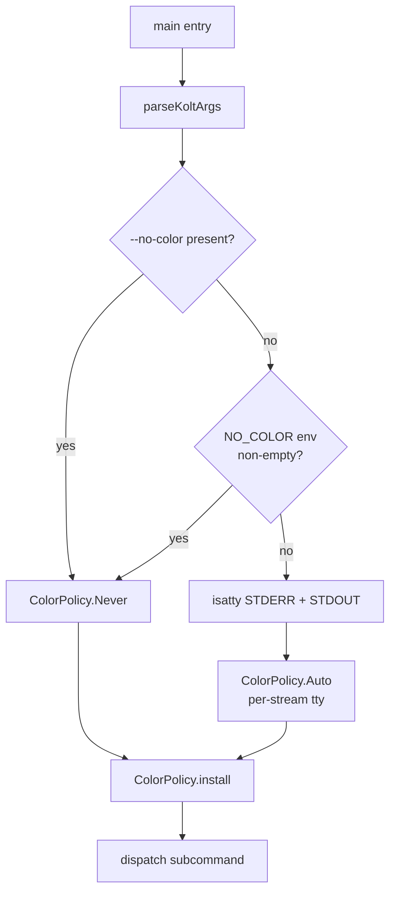
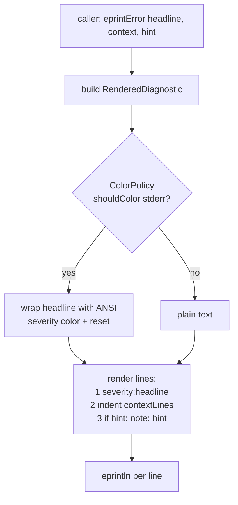
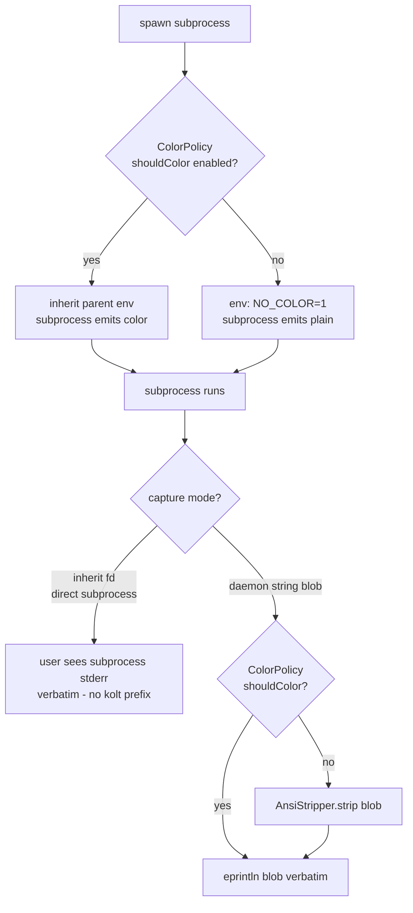

# Design Document — 2-error-output-formatting

## Overview

**Purpose**: kolt の全ユーザー向け診断出力 (error / warning / note) を、 単一の typed writer + ColorPolicy + 修復ヒント仕組みに集約し、 issue #2 (v1.0 Phase 5 DX) の要求 7 件を実現する。

**Users**: kolt CLI の対話的ユーザー (TTY) と CI ユーザー (非 TTY / `NO_COLOR`) の双方が、 整形された severity 付き診断 (適切に着色 / 着色なし) を受け取る。

**Impact**: 既存の散在した `eprintln("error: ...")` 30+ 箇所と既存の 2 つの ad-hoc renderer (`formatResolveError`, `ToolError.formatStderr`) を、 単一の `eprintError` / `eprintWarning` / `eprintNote` API 経由に統一する。 ANSI カラー / NO_COLOR / `--no-color` / TTY 判定 / Did-you-mean 提案 / kolt.toml 行番号抽出 / subprocess 色抑制をこの API の責務に集約する。

### Goals
- 全 kolt 生成診断が単一の writer 経由で出力されること (severity prefix + context インデント + hint ライン)
- ANSI カラーが TTY + non-NO_COLOR + non-`--no-color` 条件下でのみ出ること、 stdout / stderr 個別判定であること
- `kolt.toml` パース失敗時にファイル絶対パス + 行番号 (取得可能な範囲) + キーパスが診断に乗ること
- 未知サブコマンド / 未知 global flag / 未知 kolt.toml キーに対して deterministic な Did-you-mean 候補が出ること
- 既存の exit code 契約と stdout/stderr 分離が破壊的に変わらないこと
- subprocess (kotlinc / konanc / daemon) の色情報が kolt の color policy と整合すること

### Non-Goals
- 機械可読出力 (JSON / SARIF) のフォーマット定義 (別 spec 行き)
- `kotlinc` / `konanc` 自身の診断フォーマットの書き換え (kolt は pass-through のみ)
- daemon socket protocol message の構造変更
- `Result<V, E>` ADT (例: `ResolveError`) の data class 構造変更 (renderer 層の出力形だけを変える)
- 進捗インジケータ / spinner / progress bar
- `FORCE_COLOR` 環境変数サポート
- `kolt run` 等で起動する target program の出力装飾

## Boundary Commitments

### This Spec Owns
- 単一の typed diagnostic writer API (`eprintError` / `eprintWarning` / `eprintNote`) と、 その内部表現 `RenderedDiagnostic` (severity + headline + context lines + optional hint)
- `ColorPolicy` 値と、 startup 時の resolver (TTY + `NO_COLOR` env + `--no-color` flag からの 1 回計算)
- `--no-color` kolt-level CLI flag の parse とディスパッチへの伝搬 (`parseKoltArgs` 拡張)
- ANSI escape code の出力ロジック (severity → 色マッピング)、 および subprocess 出力からの ANSI strip ロジック
- `Levenshtein` ベースの fuzzy match utility (`kolt.cli.suggest` 新規モジュール) と、 未知サブコマンド / 未知 flag / 未知 kolt.toml キーへの Did-you-mean wiring
- `kolt.toml` パース失敗時の行番号抽出ロジック (ktoml `Line N: ` プレフィックスからの regex 抽出) とそれを担う `ConfigError.ParseFailed` shape の field 拡張
- subprocess (kotlinc / konanc / daemon) への `NO_COLOR=1` env 伝播ポリシー、 および daemon が string blob で返す stderr に対する ANSI strip
- 既存 2 renderer (`formatResolveError` in `kolt.resolve`, `ToolError.formatStderr` in `kolt.usertool`) の signature 変更 — 文字列返却から `RenderedDiagnostic` 返却へ
- 既存の `eprintln("error: ...")` / `eprintln("warning: ...")` 大量呼び出しの新 API への mass migration

### Out of Boundary
- `kotlinc` / `konanc` の診断フォーマット自体 (kolt は pass-through のみ)
- daemon socket protocol message (`Message` / `CompileResult` 等) の wire 構造
- `kolt info --format=json` 等の既存の構造化出力フォーマットの変更 (色を入れない契約のみ追加)
- `Result<V, E>` ADT (`ResolveError`, `ConfigError`, `ToolError`, `CompileError`, `NativeCompileError`) の variant 集合・data class 構造の変更 (renderer 層の出力 shape のみ変える)
- 既存の exit code 数値 (`ExitCodes.kt`) の変更
- 進捗インジケータ / スピナー / progress bar (別 issue)
- `FORCE_COLOR` 環境変数 (要件で out of scope 明示)
- `--watch` ループの状態行内容 (本仕様の severity 慣習を採用するが、 行内容自体は別 issue)
- `kolt run` の target program の stdout / stderr 装飾

### Allowed Dependencies
- `kolt.infra` (lowest layer, 全方向から import 可能) ← `eprintln` の隣に新 module を追加
- `platform.posix` の `isatty`, `STDERR_FILENO`, `STDOUT_FILENO`, `getenv` (cinterop 既存)
- ktoml-core 0.7.1 — message text の `Line N: ` regex 抽出のみ。 `internal` 型への cast はしない
- 既存の `parseKoltArgs` / `KoltArgs` 構造を拡張 (`useColor: Boolean` field 追加)
- 依存方向 (`cli → build → resolve / config / infra`) を厳守 — `kolt.resolve` / `kolt.usertool` から `kolt.cli.*` への upward import は禁止

### Revalidation Triggers
- ktoml major version bump → `Line N: ` 抽出 regex の検証要 (本仕様の `ConfigParseMessageFormatTest` で pin)
- `Result<V, E>` ADT の variant 追加 (新しい error class 追加時) → 新 variant の renderer が `RenderedDiagnostic` 返却契約を守ること、 hint slot を埋めること
- `parseKoltArgs` への kolt-level flag 追加 → 順序非依存性と filter ロジックへの干渉確認
- daemon protocol で stderr 配送経路が変わったとき → ANSI strip / `NO_COLOR` 伝播の貼り直し
- subprocess (kotlinc / konanc) major version bump で `NO_COLOR` semantics が変わったとき → fall back に post-strip 切り替え

## Architecture

### Existing Architecture Analysis

kolt の現状 (research.md §1 詳述):

- `kolt.infra.eprintln(msg: String)` は `STDERR_FILENO` 直書き、 buffer / formatter なし — 単一の chokepoint
- `kolt.cli.Main.parseKoltArgs` が `--no-daemon` / `--watch` / `--release` / `-D<k>=<v>` を抽出する型付きパーサ — flag 追加の単一拡張点
- `kolt.cli.ScaffoldIO` で `platform.posix.isatty` cinterop が既に import 済み — 新規 cinterop 不要
- `kolt.resolve.Resolver.formatResolveError(error)` と `kolt.usertool.ToolError.formatStderr()` が既に headline-plus-context 風の string-builder renderer をローカル実装している — 集約のテンプレートとして再利用可能
- ktoml 0.7.1 は `lineNo` を exception の `message` テキストに `"Line N: "` プレフィックスで埋め込む。 `internal` 型 (`ParseException`) なので外から pattern-match 不可、 `e.message` regex のみが安定経路
- `BuildCommands.kt:526` パターン (`eprintln(body)` 後に `eprintln(formatCompileError(...))`) で subprocess 出力の verbatim forward が既に成立 — R6.1 / R6.4 はこの形を維持

### Architecture Pattern & Boundary Map



**選択 pattern**: Hybrid 集約 (research.md Option C) — 単一 writer + 単一 ColorPolicy への集約 + 既存 ADT 構造保存 + 新規モジュール 2 つ (`kolt.infra.output`, `kolt.cli.suggest`)

**ドメイン境界**:
- `kolt.infra.output` が出力ポリシー / 整形ロジック / ANSI 知識を独占。 cli / resolve / config / usertool は `RenderedDiagnostic` を生成して渡すだけ
- `kolt.cli.suggest` は純粋ユーティリティ (Levenshtein + closestMatch)、 cli 内の dispatcher / config validator から呼ばれる
- 既存 renderer (`formatResolveError`, `ToolError.formatStderr`) は signature が `String` から `RenderedDiagnostic` に変わるが、 ADT 構造と所属パッケージは不変

**保持される既存 pattern**:
- `Result<V, E>` 経由の error 返却 (ADR 0001)
- `cli → build → resolve / config / infra` 依存方向
- `eprintln` を最終出力 chokepoint として維持 (`kolt.infra.output.eprintError` 等は内部で `eprintln` を呼ぶ)
- 既存の exit code 数値 / `ExitCodes.kt` 構造

**新コンポーネント rationale**:
- `kolt.infra.output` — ColorPolicy + Severity + Writer を 1 ヶ所に置くため。 `kolt.infra` (最下層) に置くことで全 caller (cli / resolve / config / usertool) から依存方向を犯さず import 可能
- `kolt.cli.suggest` — Levenshtein は cli dispatcher (subcommand / flag) と config validator (kolt.toml key) の双方から呼ばれる。 cli 層に置けば config から `kolt.cli.suggest` を import できないが、 config は known-key list を渡すのではなく **新規 helper を別場所に置く** か、 `kolt.cli.suggest` 内容を **`kolt.infra.suggest` に移す** かのどちらか。 → 後者を選択 (依存方向順守、 純粋ロジックなので最下層が正しい)
- 上記により、 最終的な module 配置: `kolt.infra.output` + `kolt.infra.suggest`

**Steering compliance**:
- ADR 0001 — 全エラーパスで `Result<V, E>`、 例外送出禁止 → writer / ColorPolicy / suggest は全て non-throwing
- 言語ポリシー — コード / コメント / テスト名は英語
- ktoml 2.x value class の `is Ok / is Err` 不可 → Result 経路は `getOrElse` / `getError` のみ
- `kolt-result` 慣習 → ColorPolicy は `Result` を使わない (純粋計算、 失敗なし)

### Technology Stack

| Layer | Choice / Version | Role in Feature | Notes |
|-------|------------------|-----------------|-------|
| CLI runtime | Kotlin/Native (linuxX64), Kotlin 2.3.x | Writer + ColorPolicy + Suggest が動く環境 | 既存 |
| TTY 検出 | `platform.posix.isatty` cinterop | `ColorPolicy.fromEnv` の TTY 判定 | 既存 cinterop (`kolt.cli.ScaffoldIO` で使用済み)、 新規 def 不要 |
| 環境変数読み出し | `platform.posix.getenv` cinterop | `NO_COLOR` 検出 | 既存 cinterop |
| TOML パース | `com.akuleshov7:ktoml-core` 0.7.1 | `Line N: ` プレフィックス付き message 提供 | 既存依存。 message format 変更検出のための regression test を pin |
| Stdlib regex | `kotlin.text.Regex` | 行番号抽出 + ANSI strip | 既存。 新規依存なし |

新規外部依存なし。 既存依存の使い方の拡張のみ。

## File Structure Plan

### Directory Structure

```
src/nativeMain/kotlin/kolt/
├── infra/
│   ├── FileSystem.kt                     # MOD: eprintln 既存維持、 新規ファイルから呼び出される
│   ├── output/                           # NEW directory
│   │   ├── ColorPolicy.kt                # NEW: sealed class ColorPolicy + fromEnv + install
│   │   ├── Severity.kt                   # NEW: enum Severity (Error/Warning/Note)
│   │   ├── RenderedDiagnostic.kt         # NEW: data class RenderedDiagnostic
│   │   ├── DiagnosticWriter.kt           # NEW: eprintError / eprintWarning / eprintNote + AnsiStripper
│   │   └── AnsiCodes.kt                  # NEW: ANSI escape constants (RED, YELLOW, CYAN, RESET)
│   └── suggest/                          # NEW directory (sibling of output/)
│       ├── Levenshtein.kt                # NEW: edit distance impl
│       └── ClosestMatch.kt               # NEW: closestMatch(input, candidates, threshold)
├── cli/
│   ├── Main.kt                           # MOD: parseKoltArgs に --no-color、 dispatcher で
│   │                                     #      ColorPolicy.install + 未知 subcommand に Did-you-mean
│   ├── BuildCommands.kt                  # MOD: eprintln("error: ...") 全て eprintError(...) に置換
│   ├── DependencyCommands.kt             # MOD: 同上
│   ├── ToolCommands.kt                   # MOD: ToolError.formatStderr 経路を新 API に
│   └── (other Commands)                  # MOD: 同パターン
├── config/
│   └── Config.kt                         # MOD: ktoml exception catch を拡張、
│                                         #      ConfigError.ParseFailed に lineNo / keyPath / suggestion field 追加
├── resolve/
│   └── Resolver.kt                       # MOD: formatResolveError signature 変更
│                                         #      String → RenderedDiagnostic
└── usertool/
    └── ToolError.kt                      # MOD: ToolError.formatStderr signature 変更
                                          #      String → RenderedDiagnostic
```

### Modified Files (詳細)

| Path | Change |
|------|--------|
| `kolt/infra/FileSystem.kt` | 既存 `eprintln(msg: String)` は無変更で維持 (新 API の internal target として) |
| `kolt/cli/Main.kt:127-141` | `parseKoltArgs` に `--no-color` flag 追加、 `KoltArgs.useColor: Boolean` field 追加。 dispatcher 開始時に `ColorPolicy.install(...)`。 `else` 節 (line 102) で未知 subcommand の closestMatch 呼び出し |
| `kolt/cli/Main.kt:159+` | `printUsage()` の eprintln 群はそのまま (情報表示、 severity 装飾不要) |
| `kolt/cli/BuildCommands.kt` | `eprintln("error: X")` → `eprintError("X")`、 `eprintln("warning: X")` → `eprintWarning("X")` の機械置換。 multi-line context 含む箇所 (compile failure 等) は `eprintError(headline, context)` 形に整える |
| `kolt/cli/DependencyCommands.kt` | 同上 |
| `kolt/cli/ToolCommands.kt` | `error.formatStderr()` → `eprintError(rendered.headline, rendered.context, rendered.hint)` |
| `kolt/config/Config.kt:520-524` | catch 節を `extractKtomlLineNo(e.message)` ヘルパー経由にし、 `ConfigError.ParseFailed(path, lineNo, keyPath, message, suggestion)` を返す。 unknown key の場合 `closestMatch` を試みて `suggestion` を埋める |
| `kolt/resolve/Resolver.kt:65-101` | `formatResolveError(error: ResolveError): String` → `: RenderedDiagnostic`。 各 variant の string concat を `RenderedDiagnostic(severity = Error, headline = ..., context = listOf(...), hint = ...)` に転換。 `error: ` prefix を全て削除 |
| `kolt/usertool/ToolError.kt` | `abstract fun formatStderr(): String` → `: RenderedDiagnostic`。 各 variant 同様の転換。 `LockfileMismatch` の inline `Run \`kolt update\`` ヒントは `hint` slot へ |
| `kolt/build/CompilerBackend.kt` (および daemon backend) | subprocess 起動箇所で `if (!colorEnabled) env["NO_COLOR"] = "1"` を inject。 daemon-captured stderr blob は `eprintln(body)` 直前で `if (!colorEnabled) AnsiStripper.strip(body)` を通す |

> 各ファイルは単一責務: writer は出力、 ColorPolicy は判定、 Suggest は距離計算、 既存 renderer は ADT → RenderedDiagnostic 変換のみ。 重複なし。

## System Flows

### Flow 1: Startup color policy resolution



決定順: `--no-color` → `NO_COLOR` env → TTY 判定。 `Auto` 値は stderr / stdout 個別 TTY 状態を保持し、 writer 側で stream に応じて参照。

### Flow 2: Diagnostic write path



context 行は 2 スペース indent (既存 `formatResolveError` と同じ)。 hint は別行で `note:` プレフィックス + 同じ ColorPolicy 判定。

### Flow 3: Subprocess color forwarding (kotlinc / konanc / daemon)



direct fd inherit (subprocess kotlinc / konanc) では `NO_COLOR=1` 注入のみで完結。 daemon 経路 (string blob 戻り) では ANSI strip を post-process で適用。 R6.1 / R6.2 / R6.3 を満たす。

## Requirements Traceability

| Requirement | Summary | Components | Interfaces | Flows |
|-------------|---------|------------|------------|-------|
| 1.1 | `error:` prefix → stderr | DiagnosticWriter | `eprintError(headline, context, hint)` | Flow 2 |
| 1.2 | `warning:` prefix → stderr | DiagnosticWriter | `eprintWarning(...)` | Flow 2 |
| 1.3 | `note:` prefix → stderr | DiagnosticWriter | `eprintNote(...)` | Flow 2 |
| 1.4 | context 行を 2 スペース indent | DiagnosticWriter | `RenderedDiagnostic.context: List<String>` | Flow 2 |
| 1.5 | stdout は user-requested 出力専用 | (既存維持) | — | — |
| 1.6 | exit code 不変 | (既存 `ExitCodes.kt` 維持) | — | — |
| 2.1 | TTY + non-opt-out で red/yellow/cyan | ColorPolicy + AnsiCodes | `ColorPolicy.shouldColor(Stream): Boolean` | Flow 1, Flow 2 |
| 2.2 | 非 TTY で ANSI 抑制 | ColorPolicy.Auto | 同上 | Flow 1 |
| 2.3 | `NO_COLOR` env で抑制 | ColorPolicy.fromEnv | `ColorPolicy.fromEnv(noColorFlag): ColorPolicy` | Flow 1 |
| 2.4 | `--no-color` flag で抑制 | parseKoltArgs + ColorPolicy.fromEnv | `KoltArgs.useColor` | Flow 1 |
| 2.5 | stderr / stdout 個別 TTY 判定 | ColorPolicy.Auto | `Auto(isStderrTty, isStdoutTty)` | Flow 1 |
| 2.6 | 色のみで情報を伝えない | DiagnosticWriter (severity prefix が常に text) | — | Flow 2 |
| 3.1 | kolt.toml 絶対パス | ConfigErrorEnrichment | `ConfigError.ParseFailed.path` | — |
| 3.2 | 行 / 列 (取得可能なとき) | ConfigErrorEnrichment + ktomlLineNoExtractor | `extractKtomlLineNo(message): Pair<Int?, String>` | — |
| 3.3 | 違反 key path 表示 | ConfigErrorEnrichment | `ConfigError.ParseFailed.keyPath` | — |
| 3.4 | unknown key の Did-you-mean | ConfigErrorEnrichment + ClosestMatch | `closestMatch(input, candidates, threshold): String?` | — |
| 4.1 | Maven 座標フル表示 | (既存 `ResolveError` data class 維持 + `formatResolveError` headline) | — | — |
| 4.2 | 親座標 / 宣言元 | (既存) + RenderedDiagnostic.context | — | — |
| 4.3 | 試行リポジトリ列挙 | (既存 `RepositoryAttempt`) + RenderedDiagnostic.context | — | — |
| 4.4 | sha256 mismatch の expected/observed | (既存 `Sha256Mismatch`) + RenderedDiagnostic.context | — | — |
| 5.1 | recovery command の `note:` ライン | RenderedDiagnostic.hint | — | Flow 2 |
| 5.2 | unknown subcommand の Did-you-mean | Main dispatcher + ClosestMatch | `closestMatch(input, knownSubcommands)` | — |
| 5.3 | unknown global flag の Did-you-mean | parseKoltArgs + ClosestMatch | 同上 | — |
| 5.4 | suggestion deterministic | ClosestMatch (stable iteration + 同点時 lex 順) | — | — |
| 6.1 | subprocess 出力に kolt prefix 付けない | (既存パターン維持) BuildCommands.kt:526 | — | Flow 3 |
| 6.2 | color enabled で ANSI pass-through | SubprocessColorForwarding | (env propagation) | Flow 3 |
| 6.3 | color disabled で ANSI 漏らさない | SubprocessColorForwarding + AnsiStripper | `AnsiStripper.strip(s: String): String` | Flow 3 |
| 6.4 | wrap 時 1 headline + verbatim body | (既存パターン維持) | — | Flow 3 |
| 7.1 | `--format=json` 等に ANSI 混入禁止 | (既存 `println` 経路維持。 DiagnosticWriter は stderr 専用) | — | — |
| 7.2 | stderr / stdout 分離維持 | (既存 `eprintln` / `println` 維持) | — | — |

## Components and Interfaces

| Component | Domain/Layer | Intent | Req Coverage | Key Dependencies | Contracts |
|-----------|--------------|--------|--------------|------------------|-----------|
| `ColorPolicy` | infra/output | startup 1 回計算の色決定値 | 2.1, 2.2, 2.3, 2.4, 2.5 | `isatty`, `getenv` (P0) | Service, State |
| `DiagnosticWriter` | infra/output | severity prefix + indent + hint の単一 writer | 1.1, 1.2, 1.3, 1.4, 1.6, 2.1, 2.6 | ColorPolicy (P0), `eprintln` (P0) | Service |
| `RenderedDiagnostic` | infra/output | severity + headline + context + hint の値型 | 1.1-1.4, 4.x, 5.1 | — | State |
| `AnsiStripper` | infra/output | subprocess blob から ANSI 削除 | 6.3 | — | Service |
| `ClosestMatch` (Levenshtein) | infra/suggest | fuzzy match utility | 3.4, 5.2, 5.3, 5.4 | — | Service |
| `ConfigErrorEnrichment` | config | ktoml message から lineNo / keyPath 抽出、 closestMatch 適用 | 3.1, 3.2, 3.3, 3.4 | ClosestMatch (P0) | Service |
| `ResolveErrorRenderer` | resolve | `ResolveError` → `RenderedDiagnostic` 変換 (既存 `formatResolveError` 改修) | 4.1, 4.2, 4.3, 4.4 | RenderedDiagnostic (P0) | Service |
| `ToolErrorRenderer` | usertool | `ToolError` → `RenderedDiagnostic` 変換 (既存 `ToolError.formatStderr` 改修) | 4.x, 5.1 | RenderedDiagnostic (P0) | Service |
| `SubprocessColorForwarding` | build / build.daemon | subprocess 起動時の `NO_COLOR` 注入 + daemon blob の strip | 6.1, 6.2, 6.3, 6.4 | ColorPolicy (P0), AnsiStripper (P1) | Service |
| `Main dispatcher` | cli | `--no-color` parse → ColorPolicy.install、 unknown subcommand への closestMatch 適用 | 2.4, 5.2, 5.3 | ColorPolicy (P0), ClosestMatch (P1) | Service |

### infra/output

#### ColorPolicy

| Field | Detail |
|-------|--------|
| Intent | startup 時 1 回計算される色決定値、 stream 別 |
| Requirements | 2.1, 2.2, 2.3, 2.4, 2.5 |

**Responsibilities & Constraints**
- 純粋値 — `fromEnv` 関数で構築、 install 後は不変
- 失敗パスなし (`Result` は使わない)
- stream-別 TTY 判定を内包 (stderr / stdout が独立にリダイレクトされうる)

**Dependencies**
- External: `platform.posix.isatty` (P0), `platform.posix.getenv` (P0)

**Contracts**: Service, State

##### Service Interface

```kotlin
package kolt.infra.output

enum class Stream { Stderr, Stdout }

sealed class ColorPolicy {
  abstract fun shouldColor(stream: Stream): Boolean

  data object Always : ColorPolicy() {
    override fun shouldColor(stream: Stream): Boolean = true
  }

  data object Never : ColorPolicy() {
    override fun shouldColor(stream: Stream): Boolean = false
  }

  data class Auto(val isStderrTty: Boolean, val isStdoutTty: Boolean) : ColorPolicy() {
    override fun shouldColor(stream: Stream): Boolean =
      when (stream) {
        Stream.Stderr -> isStderrTty
        Stream.Stdout -> isStdoutTty
      }
  }

  companion object {
    fun fromEnv(noColorFlag: Boolean): ColorPolicy
    fun install(policy: ColorPolicy)
    fun current(): ColorPolicy
  }
}
```

決定順 (`fromEnv`):
1. `noColorFlag == true` → `Never`
2. `getenv("NO_COLOR")` が non-null かつ非空文字列 → `Never`
3. それ以外 → `Auto(isatty(STDERR_FILENO) != 0, isatty(STDOUT_FILENO) != 0)`

`install` は module-level `var currentPolicy: ColorPolicy = ColorPolicy.Never` を更新。 startup 時 1 回呼ばれる。

**State-discipline note** (validate-design Issue 2 の解決): `install` は startup 起動時の唯一の書き換え経路。 テスト / 単発呼び出しは `install` を経由せず、 writer 関数の `policy` default argument を明示渡しで override する経路を使う (下記 DiagnosticWriter の signature 参照)。 これにより global mutable は CLI startup 1 回計算という既存の不変式に閉じる。

- Preconditions: 呼び出し前に `install` 必須 (default は `Never` なのでテストで未 install でも安全)
- Postconditions: `current()` は最後に `install` された値を返す
- Invariants: process 内で thread-safe (Kotlin/Native 単 thread CLI)、 startup 後 `install` を呼ばない契約

#### Severity & RenderedDiagnostic

```kotlin
enum class Severity { Error, Warning, Note }

data class RenderedDiagnostic(
  val severity: Severity,
  val headline: String,
  val context: List<String> = emptyList(),
  val hint: String? = null,
)
```

- `headline`: 単一行、 改行禁止 (改行を含めたい場合は context に分ける)
- `context`: 各要素 1 行、 各行は 2 スペース indent で出力される
- `hint`: optional、 別 `note:` 行として出力される (色は note severity の cyan を流用)

#### DiagnosticWriter

| Field | Detail |
|-------|--------|
| Intent | 単一 writer API、 severity → ANSI / indent / hint レンダリングを所有 |
| Requirements | 1.1-1.4, 1.6, 2.1, 2.6 |

**Service Interface**

```kotlin
package kolt.infra.output

fun eprintError(
  headline: String,
  context: List<String> = emptyList(),
  hint: String? = null,
  policy: ColorPolicy = ColorPolicy.current(),
)

fun eprintWarning(
  headline: String,
  context: List<String> = emptyList(),
  hint: String? = null,
  policy: ColorPolicy = ColorPolicy.current(),
)

fun eprintNote(
  headline: String,
  context: List<String> = emptyList(),
  hint: String? = null,
  policy: ColorPolicy = ColorPolicy.current(),
)

fun eprintDiagnostic(
  diag: RenderedDiagnostic,
  policy: ColorPolicy = ColorPolicy.current(),
)
```

`eprintError` 等は `RenderedDiagnostic` を組み立てて `eprintDiagnostic` に委譲。 既存 renderer (`formatResolveError`, `ToolError.formatStderr`) は `eprintDiagnostic(diag)` を直接呼ぶ。

**Policy resolution discipline** (validate-design Issue 2 の解決):
- 通常呼び出しは `policy` を省略し、 default arg で `ColorPolicy.current()` を読む (startup `install` 後の global)
- テストは `policy = ColorPolicy.Never` (or `Always`) を明示渡しで override する。 この経路では global state を一切触らない
- これにより writer の動作はテストごとに deterministic、 並列実行や前 test の install 残留に起因する flaky は構造的に発生しない

Rendering algorithm:
1. severity ラベル決定 (`error:` / `warning:` / `note:`)
2. `policy.shouldColor(Stream.Stderr)` で着色判定 (caller 渡し or default の current)
3. Color enabled なら severity ラベルを ANSI で wrap (red / yellow / cyan + reset)
4. headline 行 = `"{coloredOrPlainPrefix} {headline}"` を `eprintln`
5. context の各行を `"  {line}"` で `eprintln`
6. hint があれば `"{noteColoredPrefix} {hint}"` を `eprintln`

#### AnsiStripper

```kotlin
object AnsiStripper {
  // CSI sequences: ESC [ params <final-byte 0x40-0x7E>
  private val CSI_REGEX = Regex("\\x1B\\[[0-?]*[ -/]*[@-~]")
  fun strip(s: String): String = CSI_REGEX.replace(s, "")
}
```

`CSI` (Control Sequence Introducer) のみ対象。 OSC / その他 ESC sequence は kotlinc / konanc / daemon が出さない前提 (Research Needed: 確認テストを後述)。

### infra/suggest

#### ClosestMatch

| Field | Detail |
|-------|--------|
| Intent | Levenshtein 距離による fuzzy candidate 選択 |
| Requirements | 3.4, 5.2, 5.3, 5.4 |

**Service Interface**

```kotlin
package kolt.infra.suggest

fun levenshtein(a: String, b: String): Int

fun closestMatch(
  input: String,
  candidates: List<String>,
  maxDistance: Int = adaptiveThreshold(input.length),
): String?

private fun adaptiveThreshold(inputLength: Int): Int =
  if (inputLength <= 4) 1 else 2
```

Determinism (R5.4):
- candidates 列を順に走査 (caller 側で sorted を渡す)
- 最小距離が複数同点のとき、 最初に見つかった候補を返す (caller が辞書順 sorted リストを渡せば 同点時に lex 最小)
- 距離 > `maxDistance` なら `null`

### config

#### ConfigErrorEnrichment

| Field | Detail |
|-------|--------|
| Intent | ktoml exception → 行番号 / key path / Did-you-mean 付き `ConfigError` |
| Requirements | 3.1, 3.2, 3.3, 3.4 |

**Existing → New ConfigError shape**

```kotlin
sealed class ConfigError {
  data class ParseFailed(
    val path: String,
    val lineNo: Int?,
    val keyPath: String?,
    val message: String,
    val suggestion: String?,
  ) : ConfigError()
  // 既存の他 variant は変更なし
}
```

**Internal helper**

```kotlin
package kolt.config

internal val LINE_NO_REGEX = Regex("^Line (\\d+): ")

internal fun extractKtomlLineNo(message: String?): Pair<Int?, String> {
  if (message == null) return null to ""
  val match = LINE_NO_REGEX.find(message) ?: return null to message
  val n = match.groupValues[1].toIntOrNull()
  val rest = message.substring(match.range.last + 1)
  return n to rest
}
```

`Config.kt:520-524` の catch 節を以下に変更:

```kotlin
} catch (e: SerializationException) {
  val (lineNo, detail) = extractKtomlLineNo(e.message)
  val (keyPath, suggestion) = parseUnknownKey(detail) // null pair if not unknown-key
  return Err(ConfigError.ParseFailed(
    path = absolutePathOfKoltToml,
    lineNo = lineNo,
    keyPath = keyPath,
    message = detail,
    suggestion = suggestion,
  ))
}
```

`parseUnknownKey` の scope は **top-level section 名のみ** に限定 (validate-design Issue 1 の解決、 R3.4 narrowed)。 ktoml の `UnknownNameException` text パターン (`"Unknown key received: <X> in scope <Y>"`) を regex 検出し、 `<Y>` が空 (=top-level) のときだけ `closestMatch(X, KNOWN_TOP_LEVEL_SECTIONS)` を呼ぶ。 ネスト内の unknown key には suggestion を出さない (ParseFailed.message に key path のみ載る)。

```kotlin
internal val KNOWN_TOP_LEVEL_SECTIONS = listOf(
  "build", "cinterop", "classpaths", "dependencies",
  "fmt", "kotlin", "repositories", "run", "test", "tools",
).sorted()  // alphabetical for deterministic suggestion (R5.4)

private val UNKNOWN_KEY_REGEX = Regex(
  "^Unknown key received: <([^>]+)> in scope <([^>]*)>"
)

internal fun parseUnknownKey(detail: String): Pair<String?, String?> {
  val m = UNKNOWN_KEY_REGEX.find(detail) ?: return null to null
  val key = m.groupValues[1]
  val scope = m.groupValues[2]
  if (scope.isNotEmpty()) return key to null  // nested: keyPath only, no suggestion
  return key to closestMatch(key, KNOWN_TOP_LEVEL_SECTIONS)
}
```

list は ktoml format に依存しない hardcoded で、 kolt.toml schema 進化のときは catalog 1 ヶ所更新するだけ。 ネスト内 typo (例: `[kotlin] compilerr = "..."`) への suggestion は本仕様の out of scope (follow-up issue 候補)。

Renderer (`Config.kt` 内 or `kolt/cli/BuildCommands.kt` 呼び出し側):

```kotlin
fun renderConfigError(e: ConfigError.ParseFailed): RenderedDiagnostic {
  val location = if (e.lineNo != null) "${e.path}:${e.lineNo}" else e.path
  val context = buildList {
    add("at $location")
    if (e.keyPath != null) add("key: ${e.keyPath}")
  }
  val hint = e.suggestion?.let { "Did you mean `$it`?" }
  return RenderedDiagnostic(Severity.Error, e.message, context, hint)
}
```

### resolve

#### ResolveErrorRenderer (modify existing `formatResolveError`)

Signature change:

```kotlin
// before:
fun formatResolveError(error: ResolveError): String

// after:
fun formatResolveError(error: ResolveError): RenderedDiagnostic
```

各 variant の `error: ` prefix を全て削除し、 multi-line の `appendLine` パターンを `context: List<String>` に分解。 例:

```kotlin
is ResolveError.Sha256Mismatch ->
  RenderedDiagnostic(
    severity = Severity.Error,
    headline = "sha256 mismatch for ${error.groupArtifact}",
    context = listOf(
      "expected: ${error.expected}",
      "got:      ${error.actual}",
    ),
  )
is ResolveError.DownloadFailed ->
  RenderedDiagnostic(
    severity = Severity.Error,
    headline = "failed to download ${error.groupArtifact}",
    context = formatRepositoryDownloadFailure(error.failure),
  )
```

`formatRepositoryDownloadFailure` も `StringBuilder.appendLine` から `List<String>` 返却に変更。

呼び出し側 (cli):

```kotlin
// before:
eprintln(formatResolveError(error))
// after:
eprintDiagnostic(formatResolveError(error))
```

### usertool

#### ToolErrorRenderer (modify existing `ToolError.formatStderr`)

```kotlin
sealed class ToolError {
  abstract fun toExitCode(): Int
  abstract fun render(): RenderedDiagnostic   // was: fun formatStderr(): String

  data class Resolve(val cause: ToolResolutionError) : ToolError() {
    override fun render(): RenderedDiagnostic =
      when (val c = cause) {
        is ToolResolutionError.LockfileMismatch -> RenderedDiagnostic(
          severity = Severity.Error,
          headline = "tool '${c.alias}': lockfile pin '$pinned' differs from kolt.toml '$toml'",
          hint = "Run `kolt update` to refresh tool pins.",
        )
        // ...
      }
  }
  // ...
}
```

呼び出し側: `ToolCommands.kt` の `eprintln(error.formatStderr())` → `eprintDiagnostic(error.render())`。

### build / build.daemon

#### SubprocessColorForwarding

| Field | Detail |
|-------|--------|
| Intent | subprocess (kotlinc / konanc / daemon) への `NO_COLOR` 伝播 + daemon blob ANSI strip |
| Requirements | 6.1, 6.2, 6.3, 6.4 |

**戦略 (3 経路)**:
1. **kotlinc subprocess** (`SubprocessCompilerBackend.kt`): subprocess 起動 env に `if (!ColorPolicy.current().shouldColor(Stream.Stderr)) put("NO_COLOR", "1")` を追加。 fd inherit のため kolt 側の追加処理なし。 → R6.1 (verbatim) + R6.2 (color enabled で pass-through) + R6.3 (NO_COLOR で subprocess が plain 出力)
2. **konanc subprocess** (`NativeSubprocessBackend.kt`): 同上。
3. **JVM/Native daemon path** (`*DaemonBackend.kt`): daemon socket 接続前に subprocess 起動時の env に同じ注入。 daemon が return する `stderr: String` blob は cli 側の forward 直前 (`BuildCommands.kt:526` 近辺) で `if (!ColorPolicy.current().shouldColor(Stream.Stderr)) AnsiStripper.strip(body)` を適用してから `eprintln(body)`。

**Implementation Notes**
- Integration: env injection は既存の subprocess 起動 helper の内部で完結。 caller (`BuildCommands` 等) は ColorPolicy を意識しない。
- Validation (validate-design Issue 3 の解決): Kotlin 2.3.x kotlinc / konanc の `NO_COLOR` honor を **integration test で実機 pin** する。 fixture に `NO_COLOR=1 kolt --no-daemon build <forced-fail>` を走らせ、 stderr に `\x1b[` が出ないことを assert。 Kotlin compiler bump 時に同 test の green を確認する契約。
- Verified scope: Kotlin 2.3.x 系で確認した範囲では kotlinc / konanc とも `NO_COLOR` を honor することを前提とする (CI test で継続確認)。 万一将来 honor しなくなった version への bump があれば、 該当 test が RED になり、 そのとき初めて post-strip fallback を direct subprocess 経路に追加する判断を行う。
- Risks: kotlinc / konanc が将来 `NO_COLOR` を尊重しない version に bump された場合、 上記 test が RED 化して検出される。 検出時は (a) version pin を留める、 (b) post-strip を direct subprocess 経路にも追加 (architectural change) の 2 択。

### cli

#### Main dispatcher (modify existing)

**parseKoltArgs 拡張**:

```kotlin
internal const val NO_COLOR_FLAG = "--no-color"

internal data class KoltArgs(
  val useDaemon: Boolean,
  val watch: Boolean,
  val profile: Profile,
  val cliSysProps: List<Pair<String, String>>,
  val noColor: Boolean,                        // NEW
  val filteredArgs: List<String>,
)

internal fun parseKoltArgs(argList: List<String>): KoltArgs {
  // ... 既存 ...
  val noColor = koltLevel.contains(NO_COLOR_FLAG)
  val filteredArgs = koltLevel.filter {
    it != NO_DAEMON_FLAG && it != WATCH_FLAG &&
    it != RELEASE_FLAG && it != NO_COLOR_FLAG &&
    parseDFlag(it) == null
  } + passthrough
  return KoltArgs(useDaemon, watch, profile, cliSysProps, noColor, filteredArgs)
}
```

**main 起動時**:

```kotlin
fun main(args: Array<String>) {
  val koltArgs = parseKoltArgs(args.toList())
  ColorPolicy.install(ColorPolicy.fromEnv(noColorFlag = koltArgs.noColor))
  // ... 既存 dispatch ...
}
```

**Unknown subcommand → Did-you-mean** (`Main.kt:101-105`):

```kotlin
else -> {
  val unknown = filteredArgs[0]
  val candidate = closestMatch(unknown, KNOWN_SUBCOMMANDS_SORTED)
  val hint = candidate?.let { "Did you mean `$it`?" }
  eprintError("unknown command '$unknown'", hint = hint)
  printUsage()
  exitProcess(EXIT_COMMAND_NOT_FOUND)
}
```

`KNOWN_SUBCOMMANDS_SORTED` は cli 側の hardcoded sorted list (alphabetical)、 `printUsage()` の表示順とは独立。

**Unknown global flag → Did-you-mean** (`parseKoltArgs` 内):
未知の `--xxx` flag (kolt-level prefix `--` で始まり、 既知 flag set にも `-D` にも passthrough にも該当しないもの) を検出した場合、 caller (main) に伝えて `eprintError` + closestMatch + `EXIT_USAGE_ERROR` 終了。 ただし subcommand 専用 flag を kolt-level で検出してはいけないため、 `parseKoltArgs` は **kolt-level 前置 flag block (subcommand 名より前) のみ** を対象にする (既存仕様と同じ)。

## Error Handling

### Error Strategy

- 本仕様自体が「kolt のエラー出力規約」を定める仕様であり、 **本仕様内コンポーネントの失敗は基本的に存在しない**:
  - `ColorPolicy.fromEnv` は失敗しない (POSIX read のみ)
  - `levenshtein` / `closestMatch` は純粋計算
  - `extractKtomlLineNo` は match しなければ `null` 返却 (失敗ではない)
  - `AnsiStripper.strip` は always succeeds
- `eprintError` 等の writer は出力に失敗しても (ENOSPC 等) silently 続行する (既存 `eprintln` 同様)。 `Result` 型を返さない設計を踏襲。

### Error Categories and Responses

- **diagnostic 出力経路の失敗** (例: stderr fd 閉鎖): 既存 `eprintln` の動作を継承 — `write()` の失敗は無視。 user-facing change なし。
- **ktoml message format mismatch**: regex match 失敗時は `lineNo = null` で fallback。 表示は `path` のみ。 user は機能後退を被るが、 致命的失敗にはならない。
- **subprocess `NO_COLOR` 不尊重**: kotlinc / konanc が `NO_COLOR` を honor しない version では subprocess 出力に ANSI が混入する可能性。 daemon 経路は post-strip で吸収、 direct subprocess 経路は user に漏れる。 → 現バージョンでは許容、 Open Question として monitor。

### Monitoring

- 通常運用での monitoring 対象なし (CLI ツール、 ステートレス)
- self-host CI smoke (`self-host-post`) で `--no-color` / `NO_COLOR=1` 経路を 1 ケースずつ通すこと

## Testing Strategy

### Unit Tests (per component)

- `ColorPolicy.fromEnv`:
  - `--no-color` → Never
  - `NO_COLOR=` (empty) → Auto
  - `NO_COLOR=1` → Never
  - `--no-color` + `NO_COLOR=1` → Never (順序非依存)
  - flag/env なし、 isatty stub 経由で stderr-tty / stdout-non-tty → `Auto(true, false)`、 `shouldColor(Stream.Stdout) == false`

- `DiagnosticWriter` (snapshot tests):
  - `eprintError("foo")` → `error: foo\n`
  - `eprintError("foo", listOf("at /a:1"))` → `error: foo\n  at /a:1\n`
  - `eprintError("foo", hint = "try X")` → `error: foo\nnote: try X\n`
  - color enabled (`ColorPolicy.Always`) で headline に red ANSI が wrap される
  - color disabled で ANSI 含まない
  - severity 3 種それぞれ確認

- `AnsiStripper`:
  - `\x1b[31mred\x1b[0m` → `red`
  - 複数 sequence、 inline 混在
  - non-ANSI 文字列 unchanged

- `levenshtein` / `closestMatch`:
  - distance 0 / 1 / 2
  - threshold 超過は `null`
  - 候補リスト lex sorted で同点時 first-match deterministic

- `extractKtomlLineNo`:
  - `"Line 5: foo"` → `(5, "foo")`
  - `"foo"` (no prefix) → `(null, "foo")`
  - `null` (`e.message` may be null) → `(null, "")`
  - `"Line abc: foo"` → `(null, "Line abc: foo")` (toIntOrNull fail)

- `ConfigErrorEnrichment`:
  - synthetic broken `kolt.toml` (構文エラー) → `lineNo` 抽出される
  - 未知 key (`[koltn]` typo) → `keyPath` + `suggestion = "kotlin"`
  - missing required field → `keyPath` 抽出可、 `lineNo = null`

- `formatResolveError` / `ToolError.render`:
  - 既存 string-snapshot test を `RenderedDiagnostic` field-level assertion に書き換え (headline / context list / hint slot)

### Integration Tests

- `ConfigParseMessageFormatTest`: 故意に壊した `kolt.toml` に対して ktoml が `^Line N: ` プレフィックス付き message を返すことを pin。 ktoml minor bump 検出用。
- self-host smoke: `kolt build` を `NO_COLOR=1` で叩いて出力に `\x1b[` が含まれないこと、 `--no-color` でも同じ、 通常 (CI 非 TTY) でも色が出ないこと。
- subprocess color forwarding integration:
  - mock kotlinc (色 emit する fixture) を使い、 `NO_COLOR=1 kolt build` が color-free 出力を生成すること
  - daemon 経路で synthetic ANSI-included stderr blob を返す stub を入れ、 cli 出力で strip されていること
- unknown subcommand: `kolt buidl` → `error: unknown command 'buidl'` + `note: Did you mean 'build'?` + exit code `EXIT_COMMAND_NOT_FOUND`

### E2E (manual / smoke)

- TTY 環境で `kolt build` 失敗時に red `error:` prefix が見えること
- `kolt build > log.txt 2>&1` でログファイルに ANSI escape が含まれないこと (R2.2)
- `kolt build` を `tee` 経由 (stderr が pipe) で stdout TTY のみ → stderr 着色なし、 stdout (もし出れば) 着色あり (R2.5)
- `NO_COLOR=1 kolt build` で色なし
- `kolt build --no-color` で色なし
- `kolt info --format=json` 出力に ANSI 混入しない (R7.1)

### Performance

- 出力経路は既存 `eprintln` 比で 1 行あたり ANSI wrap (高々 ~10 byte 増) と stream check のみ。 perf-critical path ではないので測定対象外。

## Open Questions / Risks

| Item | Status | Mitigation |
|------|--------|------------|
| ktoml major bump で `Line N: ` / `Unknown key received` フォーマット変更 | Pinned by test | `ConfigParseMessageFormatTest` で fixture を pin、 bump 時に test green を確認 |
| kotlinc / konanc subprocess の `NO_COLOR` 尊重保証 | Pinned by test (validate-design Issue 3 解決) | `SubprocessColorForwardingIntegrationTest` で `NO_COLOR=1 kolt --no-daemon build <fail>` の stderr に ANSI が含まれないことを実機 pin。 RED 化したら version 留めるか post-strip fallback 追加 |
| daemon protocol の wire 変更で stderr blob path が変わる | Risk: Low | `SubprocessColorForwarding` の strip ポイントを protocol 側で再点検 |
| `--no-color` 以外の global flag を kolt-level で誤抽出 | Risk: Low | parseKoltArgs は `--` までを kolt-level、 以降は passthrough — 既存契約 |
| stderr / stdout 同時 redirect で TTY 判定が race | Risk: 無 | startup 1 回計算、 process 寿命中不変 |
| ネスト内 unknown key の Did-you-mean 不在 (R3.4 narrowed) | Deferred (validate-design Issue 1 解決) | top-level section のみ suggestion、 ネスト内 typo は keyPath だけ表示。 follow-up issue 候補 |
