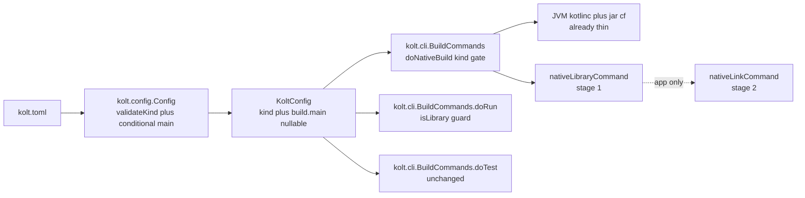
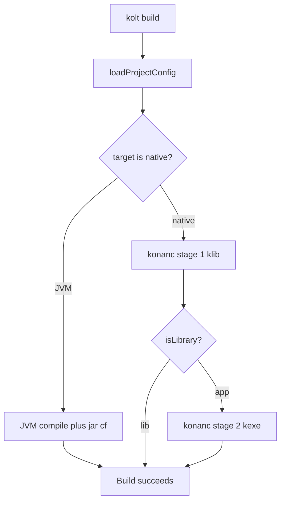

# Technical Design: lib-build-pipeline

## Overview

**Purpose**: Deliver end-to-end support for library projects (`kind = "lib"`)
across kolt's config parser, build pipeline, and run command. Unblock
`kolt publish` (#21) and the ADR 0018 self-host endgame where
`kolt-compiler-daemon/` becomes a kolt-built library rather than a Gradle
subproject.

**Users**: kolt project authors who want to publish or share a Kotlin
library without an application entry point, and the kolt project itself as
it dogfoods toward self-host.

**Impact**: The `kolt.toml` schema becomes shape-variant by `kind` —
`[build] main` transitions from universally required to conditional
(required for `kind = "app"`, forbidden for `kind = "lib"`). The native
build pipeline gains a single gate that stops after ADR 0014 stage 1 for
libraries. `kolt run` gains a pre-flight kind check. JVM library builds
produce the same thin jar shape that `kolt` already produces for apps.

### Goals
- Parser accepts `kind = "lib"` with correctly enforced conditional-`main`.
- Native library build stops at `.klib` and never produces `.kexe`.
- JVM library build produces a thin jar with no Main-Class manifest.
- `kolt run` against libraries fails fast with ADR-aligned error text.
- `kolt test` for libraries continues to work without requiring `[build] main`.

### Non-Goals
- `kolt publish` and Maven metadata generation (covered by #21).
- `fat_jar = false` for `kind = "app"` (separate axis).
- `kolt new --lib` scaffolding (covered by #28).
- New `kind` values beyond `"app"` and `"lib"`.
- Cross-target kind compatibility matrices (all existing targets accept
  both kinds without additional guards).

## Boundary Commitments

### This Spec Owns
- The runtime semantics of `KoltConfig.kind`: how parser, builder, and CLI
  interpret `"app"` vs `"lib"`.
- The conditional shape of `[build] main`: required-for-app,
  forbidden-for-lib, with the ADR 0023 §1 canonical rejection text.
- The observable `kolt build` output kind for a `kind = "lib"` project
  (`.klib` on native, thin `.jar` on JVM; never `.kexe`).
- The `kolt run` rejection contract for libraries (message + early-exit).
- Non-regression assertions that `kolt test`, `kolt check`, `kolt fmt`,
  `kolt deps`, and LSP workspace generation continue to work for libraries.

### Out of Boundary
- How library artifacts are published externally (`kolt publish`, #21).
- Any POM, Gradle module metadata, or Maven-Central coordinate derivation.
- Scaffolding commands: `kolt init` stays app-default, `kolt new --lib`
  is tracked by #28.
- Third-party consumption of kolt-built libraries (downstream of publish).
- Internal changes to ADR 0014's stage 1 or stage 2 command construction
  (`nativeLibraryCommand`, `nativeLinkCommand` are not modified).
- Changes to ADR 0013's test flow; this spec relies on its existing
  decoupling from `config.build.main`.

### Allowed Dependencies
- `kolt.config` reads and validates `kolt.toml`; no dependency on build/cli.
- `kolt.build` reads parsed `KoltConfig`; depends only on `kolt.resolve`
  and `kolt.infra`.
- `kolt.cli` orchestrates; depends on `kolt.config` and `kolt.build`.
- Dependency direction `cli → build → config/resolve/infra` is preserved;
  no new cross-package edges.
- No new external dependencies. No version bumps.

### Revalidation Triggers
- Any change to the canonical error strings (`LIB_WITH_MAIN_ERROR`,
  `APP_WITHOUT_MAIN_ERROR`, the run-reject message) — test suites match
  on substring.
- Any change that would make `[build] main` optional for `kind = "app"`
  breaks R1.
- Any new `kind` value — parser contract would need re-settlement.
- Any change to ADR 0014 that merges stages 1 and 2 — invalidates the
  "stop at stage 1" gate.
- Any change making `kolt test` depend on `config.build.main` — breaks R5.
- Any change to the `BuildResult` data class shape — current design
  relies on it staying unchanged.

## Architecture

### Existing Architecture Analysis

Kolt follows the `cli → build → config/resolve/infra` dependency
direction (see `steering/structure.md`). The three responsibility seams
for this spec are already separated:

- **Config layer** (`kolt.config.Config`): `validateKind` and
  `validateMainFqn` are the existing validation entry points;
  `RawBuildSection` is the ktoml-deserialized shape; `KoltConfig` is the
  post-validation domain model.
- **Build layer** (`kolt.build.Builder`): `nativeLibraryCommand` (ADR 0014
  stage 1) and `nativeLinkCommand` (stage 2) are paired; `doNativeBuild`
  in `kolt.cli.BuildCommands` orchestrates them.
- **CLI layer** (`kolt.cli.BuildCommands`): thin entry points (`doBuild`,
  `doRun`, `doTest`, `doCheck`) parse `KoltConfig` via `loadProjectConfig`
  and delegate.

ADR 0014, ADR 0013, ADR 0023 §1 remain in force. The decoupling of
`kolt test`, `kolt check`, `kolt fmt`, `kolt deps`, and LSP workspace
generation from `config.build.main` is an existing property confirmed in
gap analysis — no work is needed in those paths.

### Architecture Pattern & Boundary Map



**Architecture Integration**:
- Pattern: existing layered architecture; no new layers.
- Domain boundaries: `kind` is a read-only discriminator threaded from
  parser into three downstream consumers; no shared ownership.
- Preserved patterns: ADR 0014 two-stage native, ADR 0013 test flow,
  sealed-ADT error modeling, `Result<V, E>` on fallible paths, `jar cf`
  thin-jar construction, explicit no-wildcard imports.
- New components: none. All changes are conditional edits inside existing
  functions, plus one extension helper.
- Steering compliance: `cli → build → config` direction preserved;
  ADR-citation comments accompany new conditionals; error messages reuse
  the existing `ConfigError.ParseFailed` variant rather than fragmenting
  the sealed hierarchy.

### Technology Stack

| Layer | Choice / Version | Role in Feature | Notes |
|-------|------------------|-----------------|-------|
| CLI | kotlin-native 2.3.x, existing `kolt.kexe` | Hosts `kolt build`, `kolt run`, `kolt test`; gains `isLibrary` guard in `doRun` and `watchRunLoop` | No new CLI flags |
| Config parser | ktoml-core 0.7.1 (existing) | Parses `kolt.toml`; `BuildSection.main` and `RawBuildSection.main` change from `String` to `String?` | ktoml supports nullable strings natively |
| Build pipeline | kotlinc / konanc (existing) | Native stage 2 is gated off for lib; JVM jar step unchanged | No new flags; stage 2 call site becomes conditional |
| Error handling | kotlin-result 2.3.x (existing) | Canonical error strings emitted via `ConfigError.ParseFailed` and via `eprintln` + `Err(EXIT_CONFIG_ERROR)` | Errors-as-values per ADR 0001; no new exit codes |

## File Structure Plan

### Modified Files
- `src/nativeMain/kotlin/kolt/config/Config.kt`
  - `RawBuildSection.main: String` → `String?` (line 106).
  - `BuildSection.main: String` → `String?` (line 62).
  - `validateKind` (line 128): remove the `"lib"` rejection branch; keep
    the unknown-kind rejection.
  - `parseConfig`: after kind validation, apply the conditional-`main`
    rule — `kind == "lib" && raw.build.main != null` rejects;
    `kind == "app" && raw.build.main == null` rejects; `validateMainFqn`
    runs only when `main != null`.
  - New extension: `fun KoltConfig.isLibrary(): Boolean = kind == "lib"`
    (file-local, non-public API).
  - New top-level `private const val` canonical error strings (two):
    `LIB_WITH_MAIN_ERROR` and `APP_WITHOUT_MAIN_ERROR`. Both carry ADR
    0023 §1 citation in a one-line comment above.

- `src/nativeMain/kotlin/kolt/cli/BuildCommands.kt`
  - `doNativeBuild` (line 228): between the successful `nativeLibraryCommand`
    call and the `nativeLinkCommand` call, branch on `config.isLibrary()` —
    skip the link step and return `Ok(BuildResult(...))` directly.
  - `doRun`: prepend `if (config.isLibrary()) { eprintln(...); return
    Err(EXIT_CONFIG_ERROR) }` as the first statement after
    `loadProjectConfig()`, before any artifact resolution or `doBuild`
    invocation.
  - Build-success message for a library should identify the artifact as a
    library (e.g., "built library build/<name>.klib" vs the existing
    "built executable build/<name>.kexe"), purely a stdout affordance.

- `src/nativeMain/kotlin/kolt/cli/WatchLoop.kt`
  - `watchRunLoop` entry: prepend the same `isLibrary` guard so the
    rejection fires once and the loop exits cleanly instead of emitting
    the error on every source-change tick.

### Minimal signature change
- `src/nativeMain/kotlin/kolt/build/Builder.kt` — `nativeLinkCommand`
  takes an explicit `main: String` parameter in place of reading
  `config.build.main` internally. `nativeLibraryCommand` is untouched.
  This is the only behavior-preserving refactor required to keep ADR
  0001 compliance after `BuildSection.main` becomes nullable.

### Affected but Not Modified
- `src/nativeMain/kotlin/kolt/build/Workspace.kt` (LSP), `Formatter.kt`
  (`kolt fmt`), `kolt/cli/DependencyCommands.kt` (`kolt deps`) — all
  already kind-agnostic (gap-analysis verified).
- `src/nativeMain/kotlin/kolt/config/Init.kt` — `kolt init` keeps
  emitting `kind = "app"` (default) with `main = "main"`; lib scaffolding
  is #28.
- ADR 0014 / ADR 0013 machinery — untouched.

### New Test Files
- `src/nativeTest/kotlin/kolt/config/ConfigKindTest.kt` — kind acceptance
  plus the `main`-conditional matrix (five cases).
- `src/nativeTest/kotlin/kolt/cli/BuildLibraryTest.kt` — integration
  coverage: native lib build stops at `.klib`; JVM lib jar has no
  `Main-Class`; `-include-runtime` never appears in kotlinc JVM args.
- `src/nativeTest/kotlin/kolt/cli/RunLibraryRejectionTest.kt` — `doRun`
  against lib fixture returns `EXIT_CONFIG_ERROR` with canonical message;
  no artifact resolution attempted.
- `src/nativeTest/kotlin/kolt/cli/TestLibraryNonRegressionTest.kt` —
  `doTest` against lib fixture exits 0 and does not read
  `config.build.main`.

### Removed / Replaced
- `ConfigTest.kindLibIsRejectedAsNotYetImplemented` (current
  `ConfigTest.kt:311-336`) — removed; its behavior is being inverted.

## System Flows

### `kolt build` kind branching



**Key decisions**:
- JVM path is shared across kinds — the existing `jar cf` output is
  already thin and emits no Main-Class; no branching at the jar step.
- Native kind gate lives between stage 1 and stage 2 in `doNativeBuild`,
  not inside `nativeLinkCommand`. Keeping the gate at the caller
  preserves ADR 0014's stage helpers as pure commands.
- A failed stage 1 surfaces identically for app and lib.

### `kolt run` lib rejection

```mermaid
sequenceDiagram
    User->>CLI: kolt run
    CLI->>Config: loadProjectConfig
    alt config.isLibrary
        CLI-->>User: stderr library projects cannot be run; exit EXIT_CONFIG_ERROR
    else config kind is app
        CLI->>Builder: doBuild
        Builder-->>CLI: Ok
        CLI->>Runtime: exec artifact
        Runtime-->>User: program output
    end
```

**Key decisions**:
- Rejection happens before `doBuild` and before any artifact path
  resolution; watch-run applies the same guard at loop entry.
- Exit code reuses `EXIT_CONFIG_ERROR` — semantically a misuse of a
  valid config, matching the existing error category.

## Requirements Traceability

| Requirement | Summary | Component | Contract / Flow |
|-------------|---------|-----------|-----------------|
| 1.1 | lib without `main` parses | Config parser | `parseConfig` conditional rule |
| 1.2 | lib with `main` rejects, message includes canonical text | Config parser | `ConfigError.ParseFailed(LIB_WITH_MAIN_ERROR)` |
| 1.3 | app without `main` rejects with canonical text | Config parser | `ConfigError.ParseFailed(APP_WITHOUT_MAIN_ERROR)` |
| 1.4 | app with `main` parses | Config parser | Existing happy path preserved |
| 1.5 | Missing `kind` defaults to `"app"` | Config parser | Existing default logic preserved |
| 2.1 | JVM lib produces `.jar` | JVM jar step (existing) | `jarCommand` unchanged |
| 2.2 | JVM lib jar excludes runtime + deps | JVM compile + jar step | Invariant: no `-include-runtime` anywhere |
| 2.3 | JVM lib jar has no `Main-Class` | JVM jar step | `jar cf` without manifest attribute |
| 2.4 | JVM app jar unchanged | JVM jar step | Existing path, existing tests |
| 3.1 | Native lib produces `.klib` | `doNativeBuild` + stage 1 | ADR 0014 stage 1 call retained |
| 3.2 | Native lib emits no `.kexe` | `doNativeBuild` kind gate | New conditional |
| 3.3 | Native lib skips link step | `doNativeBuild` kind gate | New conditional |
| 3.4 | Native app unchanged | `doNativeBuild` | Existing stages 1+2 path |
| 4.1 | `kolt run` on lib errs with canonical message | `doRun` guard | `eprintln(RUN_LIB_ERROR)` + `EXIT_CONFIG_ERROR` |
| 4.2 | Rejection before artifact resolution | `doRun` guard | Guard position (first statement) |
| 4.3 | Rejection target-agnostic | `doRun` guard | Single check regardless of target |
| 4.4 | `kolt run` on app unchanged | `doRun` | Existing flow retained |
| 5.1 | Tests compile and run for lib | `doTest` / `doNativeTest` | Existing flow, non-regression |
| 5.2 | Test flow does not require `main` | Existing test path | Non-regression assertion |
| 5.3 | Tests for app unchanged | `doTest` | Existing flow retained |

## Components and Interfaces

| Component | Layer | Intent | Req Coverage | Key Dependencies | Contracts |
|-----------|-------|--------|--------------|------------------|-----------|
| Config parser kind+main rule | config | Accept lib; make `main` conditional | 1.1, 1.2, 1.3, 1.4, 1.5 | ktoml (P0), KoltConfig consumers (P0) | State |
| Native build kind gate | build/cli | Skip stage 2 for lib | 3.1, 3.2, 3.3, 3.4 | `nativeLibraryCommand`/`nativeLinkCommand` (P0) | Service |
| JVM thin-jar invariants | build | Lock thin-jar + no-`Main-Class` for lib | 2.1, 2.2, 2.3, 2.4 | `jar cf` (P0), kotlinc JVM (P0) | State (invariant) |
| Run command kind guard | cli | Reject lib-run before build | 4.1, 4.2, 4.3, 4.4 | KoltConfig (P0) | Service |
| Test non-regression | cli/tests | Prove tests work for lib without `main` | 5.1, 5.2, 5.3 | Existing `doTest` (P0) | State (invariant) |

### Config layer

#### Config parser kind+main rule

**Responsibilities & Constraints**
- Parse `kolt.toml` into `KoltConfig` where `kind ∈ {"app", "lib"}`
  (default `"app"`) and `BuildSection.main: String?`.

**Validation Order** (must be implemented in this sequence so error
messages are deterministic for tests and users):

1. `validateKind(raw.kind)` — reject unknown `kind` values (existing).
2. Conditional `main` presence — pairwise rejection:
   - `kind == "lib"` and `raw.build.main != null` → `Err(ConfigError.ParseFailed(LIB_WITH_MAIN_ERROR))`.
   - `kind == "app"` and `raw.build.main == null` → `Err(ConfigError.ParseFailed(APP_WITHOUT_MAIN_ERROR))`.
3. When `main != null`, run existing `validateMainFqn(main)`. (FQN
   validation never runs for libraries, so a malformed FQN on a lib
   config surfaces as the step-2 rejection rather than an FQN error.)
4. `validateTarget(raw.build.target)` and the remaining existing
   validations.
5. Construct `KoltConfig` / `BuildSection` with `main: String?`.

**Canonical Error Strings**
- `LIB_WITH_MAIN_ERROR = "main has no meaning for a library; remove it"`
  — cites ADR 0023 §1.
- `APP_WITHOUT_MAIN_ERROR = "[build] main is required for kind = \"app\""`
  — explicit rejection introduced by this spec, replacing ktoml's raw
  `MissingRequiredPropertyException` surface. This is the substring
  R1.3 tests will match.

Both are `private const val` at the top of `Config.kt`, each with a
one-line comment citing ADR 0023 §1.

**Dependencies**
- Inbound: `kolt.cli.BuildCommands.loadProjectConfig` (P0).
- Outbound: ktoml-core (P0, existing), `kolt.config.validateMainFqn`
  (P0, existing, invoked only when `main != null`).

**Contracts**: State [x]

##### Data contract

```kotlin
// kolt.config
sealed class ConfigError {
    data class ParseFailed(val message: String) : ConfigError()
    // No new variant — lib+main reuses ParseFailed with canonical message.
}

data class BuildSection(
    val target: String,
    val jvmTarget: String = "17",
    val jdk: String? = null,
    val main: String?,        // was: String
    val sources: List<String>,
    // ... unchanged fields
)

data class KoltConfig(
    val name: String,
    val version: String,
    val kind: String = "app",
    val kotlin: KotlinSection,
    val build: BuildSection,
    // ... unchanged fields
)

internal fun KoltConfig.isLibrary(): Boolean = kind == "lib"

fun parseConfig(source: String): Result<KoltConfig, ConfigError>
```

- Preconditions: `source` is syntactically valid TOML.
- Postconditions: On `Ok(KoltConfig)`, the invariant
  `kind == "lib" ⇒ build.main == null` holds, and
  `kind == "app" ⇒ build.main != null` holds. `kind ∈ {"app", "lib"}`.
- Invariants: Unknown kinds still rejected by `validateKind`; unknown
  targets still rejected by `validateTarget` (both existing).

**Implementation Notes**
- Place canonical error string as `private const val LIB_WITH_MAIN_ERROR`
  next to `validateKind` with a comment citing ADR 0023 §1.
- Do not salvage — reject eagerly when the combination is invalid.
- The `when (error) { is ConfigError.ParseFailed -> ... }` in
  `loadProjectConfig` (`BuildCommands.kt:53-55`) stays exhaustive
  without modification.

### Build / CLI layer

#### Native build kind gate

**Responsibilities & Constraints**
- `doNativeBuild` (`BuildCommands.kt:228`) runs `nativeLibraryCommand` for
  every native build. Its success produces a `.klib` at the existing
  output location.
- After stage 1 succeeds, inspect `config.isLibrary()`. If true, return
  `Ok(BuildResult(config, classpath = null, javaPath = null))` immediately
  — mirroring the existing success shape.
- If false, extract the entry-point FQN safely and invoke the link step:
  ```kotlin
  val main = config.build.main
      ?: return Err(EXIT_BUILD_ERROR)   // unreachable: parser invariant
  val link = nativeLinkCommand(config, main, ...)
  ```
  The `?: return` is a defensive-but-ADR-0001-safe path. It cannot trip
  at runtime because `parseConfig` guarantees `kind == "app" ⇒ main != null`,
  but Kotlin null-safety forces the compiler check without falling back
  to `!!` (forbidden).
- `nativeLinkCommand` gains one signature change: take `main: String` as
  an explicit parameter instead of reading `config.build.main` internally.
  Every existing call site that reads `config.build.main` via the link
  helper must be updated to pass `main` through. No behavioral change —
  same `-e main` token is emitted.
- `kolt build` user-facing success message should distinguish artifact
  kind ("library" / "executable") — stdout affordance only.

**Dependencies**
- Inbound: `kolt.cli.BuildCommands.doBuild` (P0).
- Outbound: existing `CompilerBackend` implementations via
  `nativeLibraryCommand` and `nativeLinkCommand` (P0).

**Contracts**: Service [x]

##### Service interface (unchanged signature)

```kotlin
private fun doNativeBuild(
    config: KoltConfig,
    useDaemon: Boolean
): Result<BuildResult, Int>
```

- Preconditions: `config` is the output of a successful `parseConfig`,
  so the `kind × main` invariants hold.
- Postconditions: For `kind == "lib"`, `BuildResult` is returned after
  stage 1; no `.kexe` is written at the canonical output path. For
  `kind == "app"`, behavior is byte-identical to today.
- Invariants: `BuildResult` shape remains `(config, classpath, javaPath)`.

**Implementation Notes**
- Place a one-line comment next to the new gate citing ADR 0014 (two-stage
  flow) and ADR 0023 §1 (kind schema).
- No change to stage-1 command-building — the `.klib` produced is already
  the artifact R3.1 requires.

#### JVM thin-jar invariants

**Responsibilities & Constraints**
- Existing JVM compile step must not pass `-include-runtime` to kotlinc
  for either kind (current behavior; this spec locks it in via test).
- Existing `jarCommand` uses `jar cf` without a manifest attribute —
  retains R2.3 for libraries, and for apps (R2.4 — current behavior).
- No code change in this component. The contribution is an assertion
  contract plus integration tests.

**Contracts**: State [x] (invariant assertion)

**Implementation Notes**
- Test reads the produced jar's `META-INF/MANIFEST.MF` and asserts
  absence of `Main-Class`.
- Test greps the kotlinc command line (either via daemon request or
  subprocess args) and asserts no `-include-runtime` token.

#### Run command kind guard

**Responsibilities & Constraints**
- `doRun`, first statement after `loadProjectConfig()`:
  ```kotlin
  if (config.isLibrary()) {
      eprintln("error: library projects cannot be run")
      return Err(EXIT_CONFIG_ERROR)
  }
  ```
- Guard is target-agnostic — a single check before any JVM/native
  dispatch.
- No artifact resolution (`outputKexePath`, `jvmMainClass`) is performed
  for a library.
- `watchRunLoop` applies the same guard at loop entry; emits the error
  once, exits cleanly. Does not enter the rebuild poll.

**Dependencies**
- Inbound: `kolt.cli.Main.doRun` dispatch (P0).
- Outbound: `kolt.config.KoltConfig.isLibrary` (P0).

**Contracts**: Service [x]

##### Service interface (unchanged signature)

```kotlin
internal fun doRun(args: List<String>): Result<Unit, Int>
// Same for watchRunLoop entry.
```

- Preconditions: `loadProjectConfig` succeeded.
- Postconditions: For `kind == "lib"`, returns `Err(EXIT_CONFIG_ERROR)`
  with the canonical stderr line, emits no build output. For
  `kind == "app"`, behavior unchanged.

**Implementation Notes**
- Canonical error string as `private const val RUN_LIB_ERROR =
  "library projects cannot be run"` near `doRun`, with ADR 0023 §1
  citation comment.
- Do not wrap the guard behind a `when (config.kind)` — match the
  existing CLI pattern of early-return guards.

#### Test non-regression

**Responsibilities & Constraints**
- Existing `doTest` (`BuildCommands.kt:437`) and `doNativeTest`
  (`BuildCommands.kt:492-572`) paths do not reference `config.build.main`
  (gap-analysis verified). No code change.
- Contribution is a non-regression integration test that exercises the
  full `doTest` flow on a `kind = "lib"` fixture config.

**Contracts**: State [x] (invariant assertion)

## Data Models

### `KoltConfig` (post-change)

```kotlin
data class KoltConfig(
    val name: String,
    val version: String,
    val kind: String = "app",          // domain: {"app", "lib"}
    val kotlin: KotlinSection,
    val build: BuildSection,           // BuildSection.main now nullable
    val fmt: FmtSection = FmtSection(),
    val dependencies: Map<String, String> = emptyMap(),
    val testDependencies: Map<String, String> = emptyMap(),
    val repositories: Map<String, String> = mapOf("central" to MAVEN_CENTRAL_BASE),
    val cinterop: List<CinteropConfig> = emptyList()
)

data class BuildSection(
    val target: String,
    val jvmTarget: String = "17",
    val jdk: String? = null,
    val main: String?,                 // was: String
    val sources: List<String>,
    val testSources: List<String> = listOf("test"),
    val resources: List<String> = emptyList(),
    val testResources: List<String> = emptyList()
)
```

- `kind`: enum-like string domain `{"app", "lib"}`. Unknown values
  rejected at `validateKind`.
- `main`: nullable. Post-`parseConfig` invariant
  `kind == "app" ⇒ main != null` holds unconditionally.

### `BuildResult` (unchanged)

`BuildResult(config, classpath, javaPath)` is kept as-is; a library build
returns one with `classpath = null, javaPath = null` on the native lib
path. Sum-type alternatives (`NativeLibrary` / `NativeExecutable` / `JvmJar`
variants) were considered and rejected in synthesis to minimize change
surface (see `research.md` synthesis section).

## Error Handling

### Error Strategy

Two canonical errors, both reusing existing project patterns.

| Error | Canonical message (substring) | Emitter | Surface |
|-------|-------------------------------|---------|---------|
| lib+`main` rejection | `main has no meaning for a library; remove it` | `parseConfig` step 2 | `Err(ConfigError.ParseFailed(LIB_WITH_MAIN_ERROR))` → `loadProjectConfig` → `eprintln("error: ...")` → `Err(EXIT_CONFIG_ERROR)` |
| app+no-`main` rejection | `[build] main is required for kind = "app"` | `parseConfig` step 2 | `Err(ConfigError.ParseFailed(APP_WITHOUT_MAIN_ERROR))` → `loadProjectConfig` → `eprintln("error: ...")` → `Err(EXIT_CONFIG_ERROR)` |
| library-run rejection | `library projects cannot be run` | `doRun` | `eprintln("error: ...")` → `Err(EXIT_CONFIG_ERROR)` |

### Error Categories and Responses

- **Configuration errors** (lib+`main`): user edits `kolt.toml` to remove
  `[build] main`. The message itself is self-remediating.
- **Invocation errors** (library-run): implicit remediation — use
  `kolt build` / `kolt test` instead. Watch-run exits cleanly after one
  rejection, no poll-spam.

Error constants live alongside their emitters (`Config.kt` for the
parser constant, `BuildCommands.kt` for the run-guard constant), each
with a one-line comment citing ADR 0023 §1.

## Testing Strategy

All tests live in `src/nativeTest/kotlin/` mirroring production package
structure, per `steering/structure.md`. Use `kotlin.test.*` assertions;
integration tests use the existing `testfixture` subpackage pattern.

### Unit — Config (R1)
1. `kind = "lib"` without `[build] main` → parses, `config.isLibrary()`
   true, `config.build.main` null (R1.1).
2. `kind = "lib"` with `[build] main = "com.example.main"` → `Err`,
   message contains `main has no meaning for a library; remove it`
   (R1.2).
3. `kind = "app"` without `[build] main` → `Err`, message contains
   `[build] main is required for kind = "app"` (R1.3).
4. `kind = "app"` with `[build] main` → parses, existing behavior (R1.4).
5. `kind` field omitted → defaults to `"app"`, rule (4) applies (R1.5).

### Unit — Builder native gate (R3)
1. `doNativeBuild` with `kind = "lib"` linuxX64 fixture → captures the
   commands invoked; asserts `nativeLibraryCommand` was invoked exactly
   once and `nativeLinkCommand` was never invoked; result is `Ok`
   (R3.1, R3.2, R3.3).
2. `doNativeBuild` with `kind = "app"` linuxX64 fixture → asserts both
   commands invoked; existing behavior preserved (R3.4).

### Unit — JVM invariants (R2)
1. JVM lib build → produced jar's `META-INF/MANIFEST.MF` contains no
   `Main-Class` attribute (R2.3).
2. JVM compile command for a lib config does not contain the token
   `-include-runtime` (R2.2).
3. JVM lib build emits a `.jar` at `build/<name>.jar` (R2.1).
4. JVM app build — existing tests cover R2.4; no new unit needed.

### Integration (end-to-end fixtures)
1. Native lib fixture end-to-end: `kolt build` → `build/<name>.klib`
   exists, `build/<name>.kexe` does not exist (R3.1, R3.2).
2. JVM lib fixture end-to-end: `kolt build` → `build/<name>.jar` exists,
   manifest clean (R2.1–R2.3).
3. Run rejection: `kolt run` on both JVM and native lib fixtures exits
   non-zero with `library projects cannot be run` in stderr; no build
   output generated (R4.1–R4.3).
4. App non-regression: existing `kind = "app"` fixtures (the kolt repo
   itself after removing the current `kindLibIsRejected` unit test)
   continue to build, run, and test identically (R2.4, R3.4, R4.4, R5.3).

### Non-regression — `kolt test` (R5)
1. `kolt test` on a `kind = "lib"` fixture exits 0; tests compile and
   execute (R5.1, R5.2).

### Dogfood Gate (non-blocking)
Before tagging a release, rebuild a small throwaway `kind = "lib"`
fixture and confirm the produced `.klib` / thin `.jar` is sane. This is
distinct from the actual migration of `kolt-compiler-daemon/` to a
kolt-built library, which is follow-up under ADR 0018 and outside this
spec's scope.
